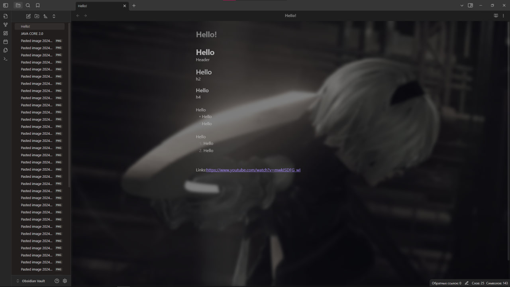
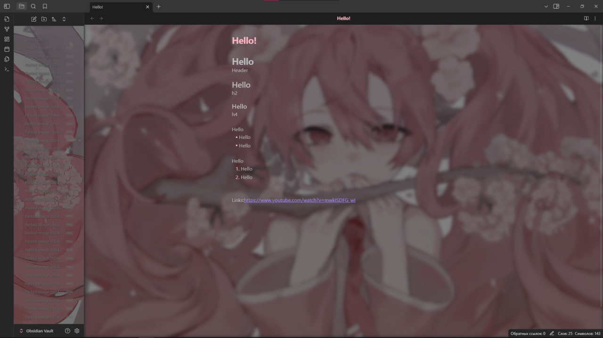

# Obsidian Anime Themess

## Introduction

I found some anime themes for Obsidian, but I wanted to make my own and share them.

Note: In my themes the sidebar is not working and I don't know how to fix it, if you know, I would be glad for your help

## Theme Preview

|:--:| 
| **Nier Automata - 2B Theme** |

|:--:| 
| **Art - Cute Tyan Theme** |

## What's responsible for what?

**Theme Color Palette**

|Argument|Example|Description|
|-|-|-|
|`--color-variable01`|red|Changes the Primary Text Color|
|`--color-variable02`|green|Changes the Secondary Text Color|
|`--color-variable04`|$0000FF|Changes most of the Collapse Indicators, Table Lines in Edit Mode, Gutter Elements|
|`--color-variable03_rgb`|0,0,255|Changes Table Lines in the Sidebar|
|`--color-variable03`|$FFFF00|Changes the Top-bar color as well as the Sidebar outlines|
|`--image-variable01`|https://i.imgur.com/removed.png|Changes the Graph Mode Image|
|`--image-variable02`|https://i.imgur.com/removed.png|Changes the Editor Mode Image|
|`--image-variable03`|https://i.imgur.com/removed.gif|Changes the Sidebar Image|

**Image Position**

|Argument|Example|Description|
|-|-|-|
|`position`|fixed|Specifies the type of positioning method used for the Editor & Graph Mode Background Image|
|`background-size`|cover|Defines the size of the Editor & Graph Mode Background Image|
|`transform`|rotateY(180deg)|Rotates the Editor & Graph Mode Background Image|
|`transform-origin`|70%|Sets the position for the Editor & Graph Mode Background Image|
|`background-position`|50%|Sets the position for the Sidebar Background Image|
|`top`|50px|Used with `position` to set the placement of the Background|
|`left`|0|Used with `position` to set the placement of the Background|
|`right`|0|Used with `position` to set the placement of the Background|
|`bottom`|0|Used with `position` to set the placement of the Background|

**Image Filter**

|Argument|Example|Description|
|-|-|-|
|`filter`|blur(4px) brightness(75%) saturate(50%)|Applies graphical effects to the Background|
|`backdrop-filter`|blur(4px) brightness(75%) saturate(50%)|Applies graphical effects to the gray Sidebar Overlay|
|`opacity`|0.75|Changes the opacity of of some elements|

## Credits

I took his themes and reworked them:
https://github.com/Cedrinya/OBSIDIAN-Anime-Themes/tree/main
